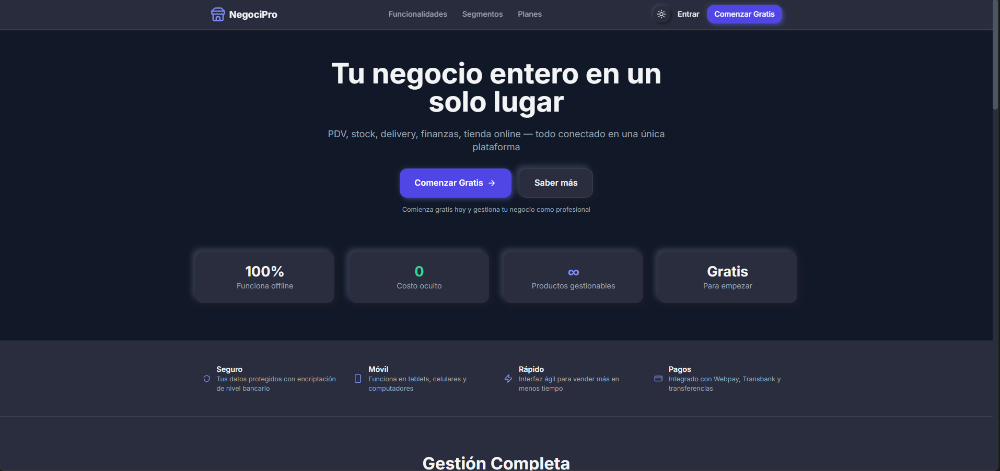
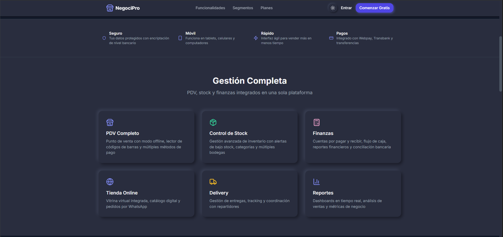
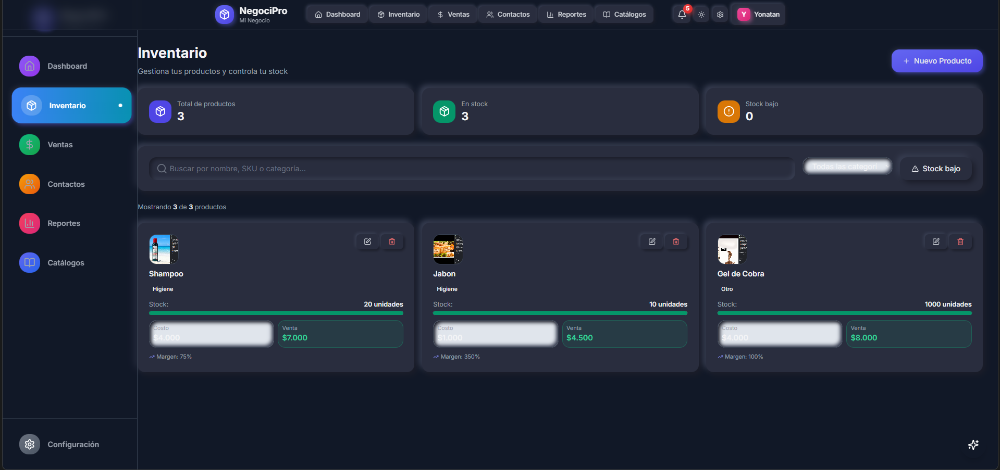
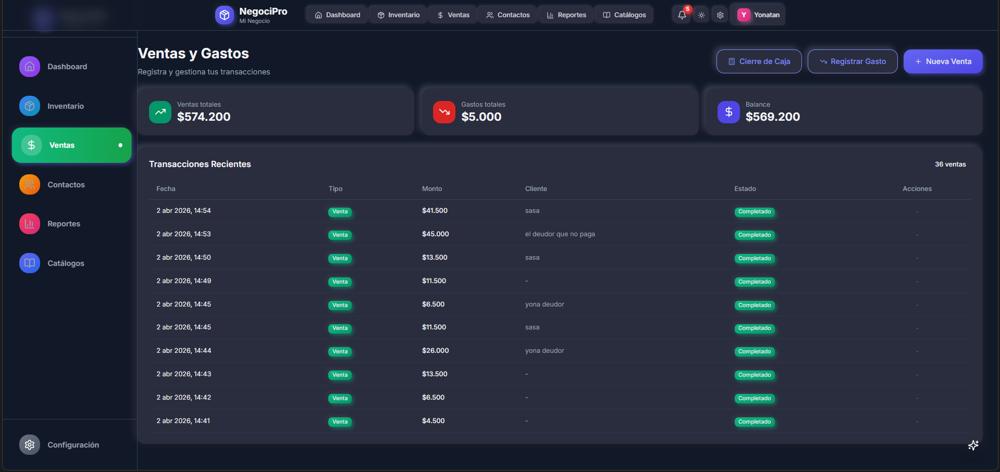
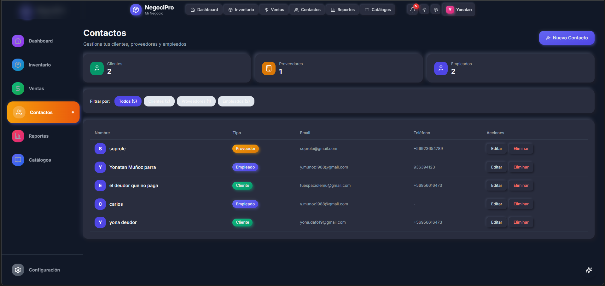
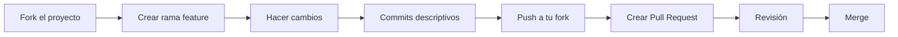

# 🏪 NegociPro

<div align="center">


**Sistema completo de gestión empresarial para pequeños negocios y emprendedores en Latinoamérica**

[](https://negociopro.vercel.app)

[Features](#-características) • [Demo](#-demo-en-vivo) • [Installation](#-instalación) • [Documentation](#-documentación) • [Contributing](#-contributing)

</div>

---

## 📖 Sobre el Proyecto

**NegociPro** es una plataforma SaaS completa diseñada para pequeños negocios que necesitan gestionar su inventario, ventas, clientes y catálogos de productos de manera simple y eficiente.

### 💡 Nuestra Misión

Democratizar el acceso a herramientas de gestión empresarial para emprendedores latinos, permitiéndoles llevar su negocio al siguiente nivel sin complicaciones técnicas.

### 🎯 Público Objetivo

- ✅ Tiendas pequeñas y medianas
- ✅ Emprendedores y freelancers
- ✅ Negocios de retail
- ✅ Comercios locales
- ✅ Vendedores ambulantes que necesitan un sistema

---

## ✨ Características

### 💼 Gestión Integral del Negocio

| Característica | Descripción |
|----------------|-------------|
| 📦 **Inventario Completo** | Control de stock en tiempo real, alertas de bajo inventario, categorías, SKU, precios de costo y venta |
| 💰 **Punto de Venta (POS)** | Registro rápido de ventas, carrito de compras, múltiples métodos de pago, cálculo automático de impuestos |
| 👥 **Gestión de Contactos** | Base de datos de clientes, proveedores y empleados con información detallada |
| 📊 **Dashboard en Tiempo Real** | Métricas clave, gráficos de ventas, alertas de stock, resumen financiero |

### 📈 Analytics y Reportes Avanzados

```
📉 Reportes Detallados
├── Ventas por período
├── Productos más vendidos
├── Mejores clientes
├── Márgenes de ganancia
└── Análisis de tendencias

📊 Visualizaciones Interactivas
├── Gráficos de ventas (Recharts)
├── Comparativas temporales
├── Desglose por categorías
└── Métricas de rendimiento

📥 Exportación de Datos
├── Excel (.xlsx)
├── PDF (jsPDF)
└── CSV
```

### 🛒 Catálogos Virtuales

| Funcionalidad | Beneficio |
|---------------|-----------|
| 🔗 **Links Compartibles** | Genera catálogos públicos con URL única |
| 🎨 **5 Temas de Color** | Personaliza la apariencia de tus catálogos |
| 📱 **Vista Pública Optimizada** | Perfecta para compartir por WhatsApp o redes sociales |
| 👁️ **Contador de Vistas** | Monitorea la popularidad de tus catálogos |
| 🛍️ **Contacto Directo** | Los clientes pueden pedir por WhatsApp directamente |

### 📱 Modo Offline First

```
💾 Funciona Sin Internet
├── Service Worker cachea la app
├── IndexedDB para datos offline
└── Operaciones se encolan

🔄 Sincronización Automática
├── Cambios se guardan localmente
├── Se sincronizan al volver la conexión
├── Indicador visual de estado
└── Manejo de conflictos

🔔 Estado de Conexión
├── Notificaciones de conexión
├── Cola de operaciones pendientes
└── Confirmación de sincronización
```

### 🎨 UI/UX Moderna

| Aspecto | Implementación |
|----------|----------------|
| 🌓 **Tema Claro/Oscuro** | Toggle con persistencia local |
| 📱 **Responsive Design** | Optimizado para móvil, tablet y desktop |
| ♿ **Accesibilidad** | WCAG AA compliant |
| ⚡ **Performance** | Code splitting, lazy loading |
| 🎭 **Animaciones** | Transiciones suaves y micro-interacciones |

---

## 🛠️ Stack Tecnológico

### Frontend

```
┌─────────────────────────────────────────────────────────────┐
│                     REACT ECOSYSTEM                       │
├─────────────────────────────────────────────────────────────┤
│ React 19          - UI Library                          │
│ Vite 6            - Build Tool & Dev Server              │
│ React Router 6     - Client-side Routing                  │
│ TailwindCSS 3     - Utility-first CSS                   │
│ Zustand           - State Management                     │
└─────────────────────────────────────────────────────────────┘
```

### Backend as a Service

```
┌─────────────────────────────────────────────────────────────┐
│                   SUPABASE STACK                          │
├─────────────────────────────────────────────────────────────┤
│ PostgreSQL        - Database Engine                       │
│ Auth             - Authentication (OAuth, Email)          │
│ Storage          - File Storage (Avatares, Imágenes)      │
│ RLS              - Row Level Security                   │
│ Realtime          - WebSocket subscriptions               │
└─────────────────────────────────────────────────────────────┘
```

### Librerías Principales

| Paquete | Uso | Versión |
|---------|------|---------|
| `@supabase/supabase-js` | Cliente Supabase | ^2.48.0 |
| `recharts` | Gráficos y visualizaciones | ^2.15.0 |
| `lucide-react` | Iconos SVG | ^0.475.0 |
| `jspdf` | Generación de PDF | ^4.2.1 |
| `xlsx` | Exportación a Excel | ^0.18.5 |
| `date-fns` | Manipulación de fechas | ^4.1.0 |
| `zod` | Validación de esquemas | ^4.3.6 |

---

## 🎥 Demo en Vivo

### 🌐 Aplicación

[](https://negociopro.vercel.app)

### 👤 Credenciales de Demo

| Tipo | Email | Contraseña |
|------|-------|------------|
| Usuario | `demo@negoci.pro` | `Demo123!` |

### 📸 Screenshots

<div align="center">



")




</div>

---

## 📦 Instalación

### Requisitos Previos

```
✅ Node.js 18+ y npm/yarn
✅ Cuenta en [Supabase](https://supabase.com)
✅ Git instalado
✅ Editor de código (VS Code recomendado)
```

### Paso 1: Clonar el Repositorio

```bash
git clone https://github.com/yonadafo19-bot/negociopro.git
cd negociopro
```

### Paso 2: Instalar Dependencias

```bash
npm install
```

### Paso 3: Configurar Supabase

1. **Crear proyecto en Supabase**
   - Ve a [supabase.com](https://supabase.com)
   - Crea un nuevo proyecto

2. **Ejecutar migraciones SQL**
   - Ve a **SQL Editor** en el dashboard de Supabase
   - Ejecuta los archivos en `supabase/migrations/` en orden:
     ```
     001_initial_schema.sql
     002_rls_policies.sql
     ```

3. **Copiar credenciales**
   - Ve a **Settings → API**
   - Copia tu **Project URL** y **anon key**

### Paso 4: Configurar Variables de Entorno

```bash
# Copiar el archivo de ejemplo
cp .env.example .env

# Editar el archivo .env con tus credenciales
```

```env
# Supabase Configuration
VITE_SUPABASE_URL=https://tu-proyecto.supabase.co
VITE_SUPABASE_ANON_KEY=tu-anon-key-here

# Google Gmail API (opcional, para envío de emails)
VITE_GOOGLE_CLIENT_ID=tu-client-id-here
VITE_GOOGLE_API_KEY=tu-api-key-here

# Google Analytics (opcional)
VITE_GA_MEASUREMENT_ID=G-XXXXXXXXXX
```

### Paso 5: Iniciar Desarrollo

```bash
npm run dev
```

Abre [http://localhost:3000](http://localhost:3000) en tu navegador.

---

## 📁 Estructura del Proyecto

```
negociopro/
├── 📁 public/                    # Archivos estáticos
│   ├── sw.js                     # Service Worker para offline
│   ├── manifest.json              # PWA Manifest
│   ├── offline.html               # Página offline
│   └── favicon.svg               # Favicon
│
├── 📁 src/
│   ├── 📁 components/            # Componentes React
│   │   ├── 📁 common/          # Componentes compartidos
│   │   │   ├── Button.jsx
│   │   │   ├── Input.jsx
│   │   │   ├── Modal.jsx
│   │   │   └── ...
│   │   ├── 📁 layout/          # Layout components
│   │   │   ├── Header.jsx
│   │   │   └── Sidebar.jsx
│   │   ├── 📁 dashboard/       # Componentes del dashboard
│   │   ├── 📁 inventory/       # Componentes de inventario
│   │   ├── 📁 sales/           # Componentes de ventas
│   │   ├── 📁 contacts/        # Componentes de contactos
│   │   ├── 📁 reports/         # Componentes de reportes
│   │   ├── 📁 catalogs/        # Componentes de catálogos
│   │   ├── 📁 settings/        # Componentes de settings
│   │   └── 📁 connection/      # Componentes de conexión
│   │
│   ├── 📁 context/              # React Context API
│   │   ├── AuthContext.jsx      # Contexto de autenticación
│   │   ├── ThemeContext.jsx     # Contexto de tema
│   │   └── ConnectionContext.jsx
│   │
│   ├── 📁 hooks/               # Custom Hooks
│   │   ├── useAuth.js
│   │   ├── useInventory.js
│   │   ├── useSales.js
│   │   └── ...
│   │
│   ├── 📁 pages/               # Páginas principales
│   │   ├── Dashboard.jsx
│   │   ├── Inventory.jsx
│   │   ├── Sales.jsx
│   │   ├── Contacts.jsx
│   │   ├── Reports.jsx
│   │   ├── Catalogs.jsx
│   │   └── Settings.jsx
│   │
│   ├── 📁 services/            # Servicios API
│   │   ├── supabase.js         # Cliente de Supabase
│   │   ├── emailService.js     # Servicio de email
│   │   └── gmailService.js     # Gmail API
│   │
│   ├── 📁 routes/              # Configuración de rutas
│   ├── App.jsx                 # Componente principal
│   └── main.jsx                # Entry point
│
├── 📁 supabase/                # Migraciones SQL
│   └── 📁 migrations/
│       ├── 001_initial_schema.sql
│       └── 002_rls_policies.sql
│
├── 📁 docs/                    # Documentación
│   ├── DEPLOYMENT_GUIDE.md
│   ├── TESTING_GUIDE.md
│   └── OFFLINE_DOCUMENTATION.md
│
├── 📄 .eslintrc.json          # Configuración de ESLint
├── 📄 vite.config.js           # Configuración de Vite
├── 📄 tailwind.config.js       # Configuración de Tailwind
├── 📄 vercel.json              # Configuración de Vercel
├── 📄 package.json             # Dependencias y scripts
└── 📄 README.md                # Este archivo
```

---

## 🚀 Scripts Disponibles

```bash
# Desarrollo
npm run dev              # Inicia servidor de desarrollo
npm run build            # Build para producción
npm run preview          # Preview del build local

# Calidad de Código
npm run lint             # Ejecutar ESLint
npm run lint:fix         # Corregir problemas de linting
npm run format           # Formatear código con Prettier

# Testing
npm run test             # Ejecutar tests unitarios
npm run test:ui          # Tests con UI de Vitest
npm run test:coverage    # Tests con coverage report

# Deploy
npm run predeploy        # Build + tests antes de deploy
npm run deploy:vercel    # Deploy a Vercel
```

---

## 📚 Documentación

| Documento | Descripción |
|-----------|-------------|
| [Guía de Despliegue](./docs/DEPLOYMENT_GUIDE.md) | Instrucciones completas de despliegue a producción |
| [Guía de Testing](./docs/TESTING_GUIDE.md) | Estrategias de testing y ejemplos |
| [Documentación Offline](./docs/OFFLINE_DOCUMENTATION.md) | Sistema offline y sincronización |

---

## 🌐 Deploy

### Vercel (Recomendado) 🚀

[](https://vercel.com/new/clone?repository-url=https://github.com/yonadafo19-bot/negociopro)

**Pasos:**

1. Click en el botón de arriba
2. Conecta tu repositorio de GitHub
3. Configura las variables de entorno
4. ¡Deploy automático en cada push!

### Manual

```bash
npm run build
vercel --prod
```

---

## 🤝 Contributing

¡Las contribuciones son bienvenidas! Por favor sigue estas guías:

### Proceso de Contribución



### Guías de Código

- Sigue el estilo de código existente
- Usa ESLint y Prettier
- Escribe tests para nuevas features
- Documenta funciones complejas
- Mantén los commits pequeños y enfocados

### Commit Messages

```
tipo(alcance): descripción

[opcional cuerpo]

[opcional pie]
```

**Tipos:**
- `feat`: Nueva funcionalidad
- `fix`: Corrección de bug
- `docs`: Cambios en documentación
- `style`: Formato de código
- `refactor`: Refactorización
- `test`: Agregar o modificar tests
- `chore`: Tareas de mantenimiento

**Ejemplo:**
```
feat(gmail): add Gmail API integration for sending emails

Users can now connect their Gmail account to send catalogs
and receipts directly from their Gmail account.

Co-Authored-By: Claude Opus 4.6 <noreply@anthropic.com>
```

---

## 📝 Roadmap

### Versión 1.1 (Próximo lanzamiento) 🔜

- [ ] Sistema de facturación electrónica
- [ ] Integración con pasarelas de pago (Stripe, MercadoPago)
- [ ] Múltiples monedas y idiomas
- [ ] Exportar a PDF mejorado
- [ ] Modo multi-sucursal
- [ ] Backup y restore de datos

### Versión 2.0 (Futuro) 🚀

- [ ] App móvil nativa (React Native)
- [ ] Sincronización en tiempo real con WebSockets
- [ ] Análisis predictivo con IA
- [ ] Integración con contabilidad electrónica
- [ ] Marketplace de integraciones
- [ ] Sistema de fidelización de clientes

---

## 🏆 Creado con ❤️ por el equipo de NegociPro

<div align="center">

**Democratizando la gestión empresarial para todos los emprendedores**

[](https://github.com/yonadafo19-bot/negociopro/stargazers)
[](https://github.com/yonadafo19-bot/negociopro/network/members)
[](https://github.com/yonadafo19-bot/negociopro/issues)
[](https://github.com/yonadafo19-bot/negociopro/blob/main/LICENSE)

**⭐ Si te gusta este proyecto, dale una estrella en GitHub!**

[⬆ Volver al inicio](#-negociopro)

</div>
